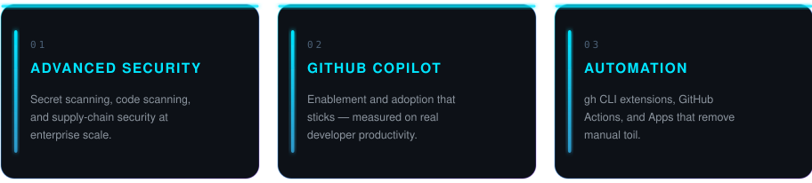

## ⚡ whoami

**Sr Solution Architect @ GitHub.** I help large organizations deliver secure software *quickly* — embedding **GitHub Advanced Security**, scaling **Copilot** adoption, and **automating** the platform so engineering teams spend less time on toil and more on innovation and growth.

## 🎯 What I focus on

## 🧰 Featured work

<b><code>gh</code> CLI extensions</b>

| Extension | What it does |
| --- | --- |
| [**gh-language**](https://github.com/CallMeGreg/gh-language) | Analyze language usage across a GitHub Enterprise |
| [**gh-secret-scanning**](https://github.com/CallMeGreg/gh-secret-scanning) | Triage & manage secret scanning alerts at scale |
| [**gh-security-config**](https://github.com/CallMeGreg/gh-security-config) | Create & apply security configurations across an enterprise |
| [**gh-custom-roles**](https://github.com/CallMeGreg/gh-custom-roles) | Define custom repository roles across an organization |

<b>GitHub Apps</b>

| App | What it does | Stack |
| --- | --- | --- |
| [**alert-dismissal-automation**](https://github.com/callmegreg-demo-org/alert-dismissal-automation) | Automatically deny non-compliant alert dismissal requests | `JavaScript` |

<b>GitHub Well-Architected Framework</b>

| Article | Area |
| --- | --- |
| [NIST SSDF implementation](https://learn.github.com/well-architected/scenarios/nist-ssdf-implementation) | Scenario |
| [Prioritizing security alerts](https://learn.github.com/well-architected/application-security/recommendations/prioritizing-alerts) | Application security |
| [Securing GitHub Actions](https://learn.github.com/well-architected/application-security/recommendations/actions-security) | Application security |
| [Enforcing GHAS at scale](https://learn.github.com/well-architected/application-security/recommendations/enforce-ghas-at-scale) | Application security |
| [Adopting Copilot at scale](https://learn.github.com/well-architected/productivity/recommendations/adopting-copilot-at-scale) | Productivity |

